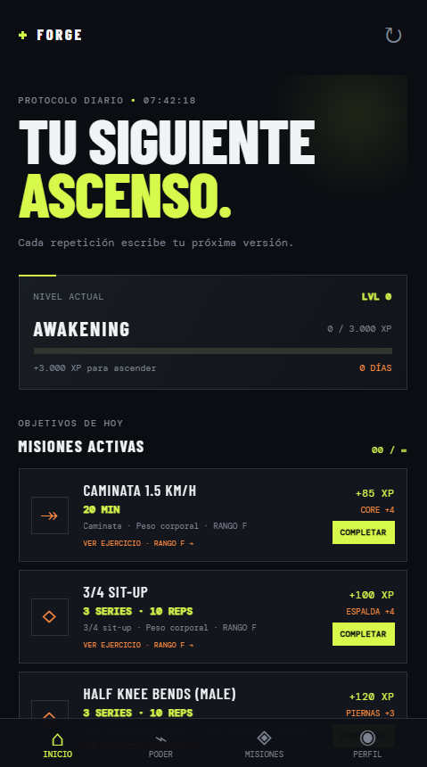
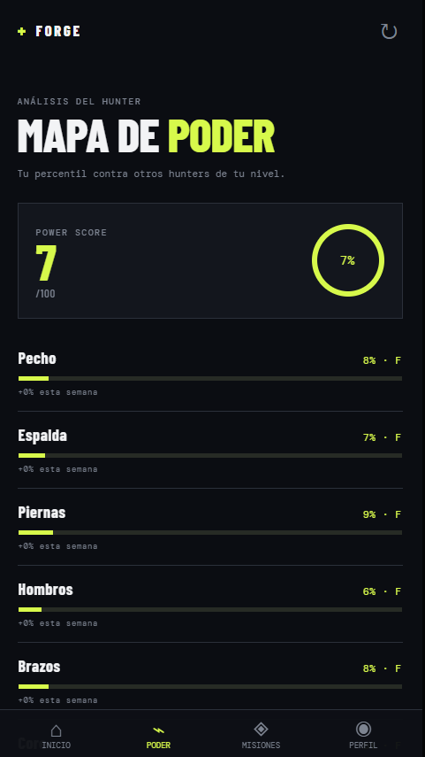
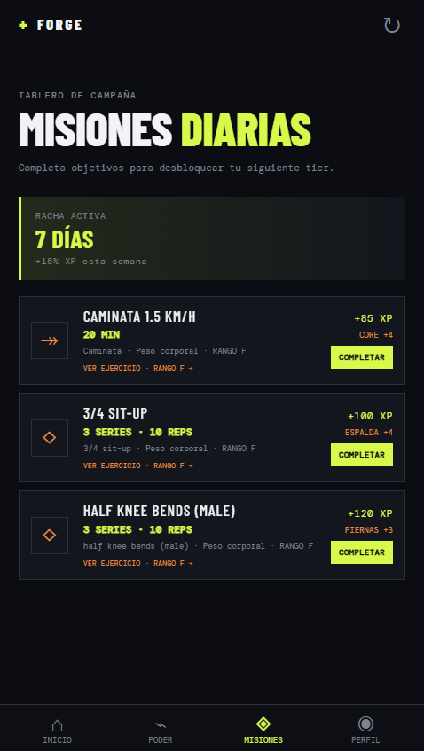

# Forge Protocol

Prototipo mobile-first de un tracker personal de entrenamiento gamificado, inspirado en una interfaz de ascenso tipo anime dark fantasy.

Para empaquetarlo e instalarlo en Android, ver [ANDROID.md](ANDROID.md).

Si querés instalar la app como APK, descargá el archivo de la última publicación disponible en la sección [Releases](../../releases) del repositorio.

## Ejecutar

Abrir `index.html` directamente en un navegador moderno. No requiere instalación, cuenta, servidor ni backend. El progreso se guarda localmente con `localStorage`.

## Incluye

- Misiones diarias de pecho, espalda y piernas.
- XP, nivel, racha y rango que cambian al completar misiones.
- Panel de poder con percentiles por grupo muscular, tiers y punto débil.
- Perfil local sin autenticación.
- Manifest para instalarlo como PWA en Android desde el navegador.
- Catálogo local de 253 ejercicios seguros de peso corporal o barra de dominadas.

## Capturas

	
	
	

## Dataset

Las misiones están basadas en la estructura y ejercicios de [hasaneyldrm/exercises-dataset](https://github.com/hasaneyldrm/exercises-dataset), que contiene 1.324 ejercicios con target muscular, músculos secundarios, equipamiento, instrucciones y media. El catálogo local `data/bodyweight-exercises.js` contiene 253 ejercicios filtrados para usar únicamente peso corporal o barra de dominadas. Las referencias de vídeo utilizadas pertenecen a Gym visual; conservar la atribución y revisar sus términos antes de distribuir media en producción.